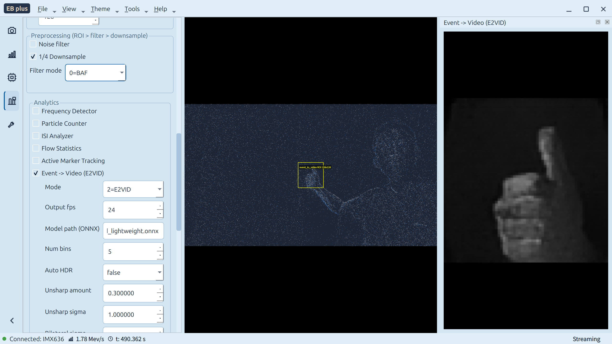

<div align="center">

# EB plus

基于 [openEB](https://github.com/prophesee-ai/openeb) v5.2.0 的开源 Qt 6 事件相机桌面应用。

实时可视化 · 相机控制 · 录制回放 · 标定 · 当前 33 项 registry · 可定制主题




</div>

---

## 这是什么？

**EB plus** 是一个美观、开源、功能丰富的事件相机 GUI 工具，支持 Prophesee / CenturyArks 事件相机。事件相机不采集帧——它以微秒级时间分辨率逐像素报告亮度变化。EB plus 提供完整的事件数据桌面工作流：

- **实时显示** 事件流（OpenGL，60+ FPS）
- **控制相机** —— biases、ROI、抗闪烁、触发
- **录制与回放** RAW 事件文件，支持速度控制与跳转
- **运行算法** —— 噪声过滤、光流、目标跟踪、事件转视频等
- **标定相机** —— 非对称圆点阵列工作流
- **导出** 为 HDF5 / CSV / AVI

本项目完全开源，欢迎 fork 并按需修改。

> **什么是事件相机？** 与传统帧相机不同，事件相机输出异步的逐像素亮度变化——"事件"——具有微秒级时间分辨率、高动态范围和低功耗。

---

## 快速开始

```bash
# 编译
cmake -B build -DCMAKE_BUILD_TYPE=Release
cmake --build build -- -j$(nproc)

# 运行（启动脚本会自动设置所有必需的环境变量）
./run.sh
```

启动脚本会自动处理 Wayland 兼容、HAL 插件路径和 OpenGL 后端选择。

> **环境要求**：Ubuntu 22.04+ · GCC 13+ · Qt 6 · OpenCV 4。详见 [devlog/compile.md](devlog/compile.md)。

## 开发文档

macOS 支持目前正在开发中，尚未达到正式发布状态。以上构建和运行说明仍是当前的 Linux 工作流。

OpenEB 5.2 CenturyArks 并列 profile 已在 macOS arm64 上使用一台 PID `0003`
相机验证了枚举、打开、重新打开和有界的 OpenEB-level CD event delivery。
EBplus GUI live lifecycle 与 facility 验证仍在进行中。

- [仓库工作流与协作规则](AGENTS.md)
- [macOS 移植路线](docs/macos_porting_plan.md)
- [macOS frozen upstream baseline integration validation](docs/macos_upstream_baseline_integration_validation.md)
- [OpenEB 版本隔离规范](docs/openeb_version_isolation.md)
- [OpenEB 5.2 macOS 构建审计](docs/openeb_5_2_macos_build_audit.md)
- [HDF5 ECF 依赖恢复](docs/hdf5_ecf_dependency_recovery.md)
- [OpenEB 5.2 macOS 构建命令草案](docs/openeb_5_2_macos_build_command_draft.md)
- [CenturyArks OpenEB 5.x 源码审计](docs/centuryarks_openeb_5x_source_audit.md) — 来源、许可证和 hunk 级审计
- [CenturyArks OpenEB 5.2 集成计划](docs/centuryarks_openeb_5_2_integration_plan.md) — 并列插件架构和验证边界
- [CenturyArks OpenEB 5.2 overlay 构建记录](docs/centuryarks_openeb_5_2_overlay_build.md) — Phase 1 构建和有限硬件验证记录
- [仓库内工作区与磁盘使用规范](docs/local_workspace_policy.md)
- [Linux 功能基线](docs/linux_baseline_inventory.md)
- [Linux/macOS 平台对齐矩阵](docs/platform_parity_matrix.md)

---

## 功能特性

### 实时事件显示
- OpenGL 加速渲染（GLSL 3.30 core profile，letterbox 视口）
- 可配置 accumulation time、frame rate/FPS limit 与 display palette
- 4 种色彩主题：Dark、Light、CoolWarm、Gray
- 实时统计：事件率、ON/OFF 比、FPS、时间戳

### 相机控制面板
- **Biases 面板** —— 动态枚举所有 HAL bias，滑块 + 精确输入 + Reset，保存/加载 `.bias` 文件
- **统一 ROI/RONI** —— 一个状态：live camera 使用硬件 `I_ROI`/RONI，文件回放使用软件 crop/RONI
- **ESP 面板** —— Anti-Flicker（模式/频带/预设/占空比/阈值）、Trail Filter（类型/阈值）、ERC（目标事件率）
- **Trigger 面板** —— Trigger In（逐通道启用）+ Trigger Out（启用/周期/占空比）

依赖 HAL facility 的 Biases、ESP 和 Trigger 控件会在对应 facility 不可用时优雅
降级；统一 ROI 在文件回放时仍通过 software crop/RONI 路径可用。

### 录制与回放
- RAW 录制 —— 实时相机流录制，带实时缓冲刷新
- 文件回放 —— 支持 `.raw`、`.hdf5`、`.h5`、`.dat`，并提供速度控制、立即渲染的跳转、暂停/恢复、loop、EOF restart 与位置追踪
- 文件裁剪 —— 从事件文件中提取时间段

### 数据导出与转换
- 将事件文件源转换为 HDF5 或 CSV，并可裁剪 RAW 片段
- 将 source events 导出为 HDF5 或 AVI；AVI 使用
  `PeriodicFrameGenerationAlgorithm` 与同步 `cv::VideoWriter`

HDF5 source-event export 不等于通用 algorithm-result export。

### 事件预处理滤波链
7 个可叠加 OpenEB event transforms，线程安全管线：Polarity Filter、Polarity
Invert、Flip X、Flip Y、Rotate、Transpose、Rescale。统一 ROI/RONI 是独立状态，不是第 8 个 FilterChain stage。

### 算法（当前 registry：33 项）
当前 `AlgoBridge` registry 有 **26 个自研算法**（19 CV + 7 analytics）和
**7 个 OpenEB FilterChain event transforms**。registry inventory 表示 source
availability，不等于所有算法已经 runtime verified。

| 类别 | 示例 |
|------|------|
| **滤波** | Hot Pixel Filter、Background Mask、Bandpass Filter、Trigger Synced |
| **运动** | Sparse Optical Flow（4 模式）、Direction Selective、EIS / Optical Gyro |
| **检测** | Blob Detector、Corner Detector（EndStopped/TypeCoincidence/Harris/Arc）、Line Segment（ELiSeD）|
| **跟踪** | Object Tracker（RCT/Median/Kalman/MultiHypothesis）、Hough Circle、Hough Line、Active Marker |
| **重建** | Event-to-Video —— **E2VID**（默认，DL）、BardowVariational、InteractingMaps |
| **分析** | Frequency Detector、Flow Statistics、ISI Analyzer、Particle Counter、Auto Bias |
| **可视化** | Time Surface、XYT 3D 点云、Orientation Cluster |
| **非 registry 工作流** | Devices panel Sensor Self-Test；Tools → Intrinsic Wizard |

算法**互斥**——启用一个会禁用上一个。自研算法使用共享 preprocessing
controls，而 unified ROI/RONI 单独管理。所有算法参数仅在**侧栏**（`AlgorithmsPanel`）调节；算法显示窗口只展示标题与输出，避免两处独立参数面板不同步。

#### 噪声滤波（共享预处理）
9 种模式按所选滤波器在侧栏暴露：BAF、STCF、Refractory、DWF、AgePolarity、Harmonic、Repetitious、SpatialBP、KNoise。

#### E2VID / Event-to-Video

Event-to-Video 具有 BardowVariational、InteractingMaps 与 E2VID modes。E2VID
可使用 optional ONNX Runtime/model pair；本仓库不跟踪 ready-to-run model 或完整的
portable runtime pair。因此真实 inference 的结论需要单独合格的兼容 runtime/model
pair；缺少或加载失败时应用使用 heuristic fallback。GUI 暴露模型、bin、auto-HDR、锐化与双边滤波控制。

> **无 ONNX Runtime 时**：E2VID 自动回退到启发式模式（体素网格求和 + Sigmoid）。BardowVariational 和 InteractingMaps 模式无需任何额外依赖——BardowVariational 通过 Chambolle-Pock 原始-对偶优化联合估计光流与亮度（六个 λ 正则化项），InteractingMaps 使用六张互连图（I/G/V/F/C/R）交替松弛，旋转由线性最小二乘估计。

详见 [devlog/design.md §4.4.2](devlog/design.md)。

### 主题
- **5 种背景色**：Gray、Green、Yellow、Pink、Blue（默认）
- **3 种模式**：Follow System（默认）、Always Light、Always Dark
- 暗色模式使用所选颜色的**暗色变体**——而非纯黑
- 文字颜色自动适配（浅色背景用黑，暗色背景用白）
- 设置跨重启持久化；标题栏跟随主题

### 多窗口与布局
- XYT 3D 事件点云（GPU 加速）
- 额外算法显示窗口（可停靠）
- 布局保存/恢复到 JSON

---

## 目录结构

```
GUI-for-openEB/
├── gui/              # Qt 6 应用
│   ├── main_window.*     # 主窗口：标题栏菜单、dock、信号连接
│   ├── display/          # OpenGL 视口、叠加层、3D 点云
│   ├── panels/           # VSCode 风格侧栏面板（5 组 11 个面板）
│   ├── app/              # 控制器（相机、管线、主题…）
│   ├── algo_bridge/      # 算法注册表 + 滤波链
│   ├── recorder/         # RAW 录制 & 回放
│   ├── exporter/         # HDF5/CSV/AVI 导出
│   ├── calibration/      # 内参向导
│   └── widgets/          # 标题栏、ActivityBar、AlgoWindow
├── algo/              # 自研算法库
├── openeb/            # openEB SDK（Apache 2.0，v5.2.0）
├── models/            # E2VID PyTorch → ONNX 转换
├── run.sh             # 启动脚本（环境变量设置）
├── devlog/               # 设计规格 + 编译指南 + wiki
└── pic/               # 截图
```

---

## 运行

### 方式一：启动脚本（推荐）

```bash
./run.sh
```

脚本自动检测 Wayland，强制 XCB + OpenGL（避免黑屏），并设置 HAL/HDF5 插件路径。

### 方式二：手动启动

```bash
export LD_LIBRARY_PATH="${LD_LIBRARY_PATH:-}:/usr/local/lib"
export HDF5_PLUGIN_PATH="/usr/local/lib/hdf5/plugin"
export MV_HAL_PLUGIN_PATH=/usr/local/lib/metavision/hal/plugins  # Prophesee
# export MV_HAL_PLUGIN_PATH=/usr/lib/CenturyArks/hal/plugins     # CenturyArks
export QT_QPA_PLATFORM=xcb       # Wayland 对 QOpenGLWidget 渲染黑屏
export QSG_RHI_BACKEND=opengl    # Qt 6 可能默认使用 Vulkan

./build/gui/gui_for_openeb
```

### 相机厂商配置

| 厂商 | HAL 插件路径 |
|------|-------------|
| Prophesee | `/usr/local/lib/metavision/hal/plugins` |
| CenturyArks | `/usr/lib/CenturyArks/hal/plugins` |

---

## 常见问题

**启动后黑屏** —— 使用启动脚本。若手动启动，设置 `QT_QPA_PLATFORM=xcb` 和 `QSG_RHI_BACKEND=opengl`。

**相机未检测到** —— 确认 `MV_HAL_PLUGIN_PATH` 与你的厂商匹配，运行 `metavision_hal_ls` 检查。

**"NonMonotonicTimeHigh" 错误** —— 这是部分 Gen3.x 相机启动时约 50% 概率出现的 Evt3 协议瞬态警告。EB plus 将其视为非致命，保持流运行。无需处理。

**暗色模式不跟随系统** —— 需要 Qt 6.5+。旧版 Qt 请用 Theme → Mode → Dark。

---

## 快捷键

| 快捷键 | 功能 |
|--------|------|
| `Ctrl+O` | 打开文件 |
| `Ctrl+Shift+P` | 切换回放面板 |
| `F11` | 全屏 |
| `Ctrl+Q` | 退出 |

---

## 已知问题与反馈

EB plus 正在持续开发中，可能仍存在 BUG。如果你在使用过程中遇到任何问题——崩溃、渲染异常、控件失灵或非预期行为——欢迎[提交 issue](../../issues)。来自真实用户的反馈是最直接的帮助。

---

## 许可证

- **项目原创代码**：[MIT](LICENSE)
- **openEB SDK**：[Apache 2.0](openeb/licensing/LICENSE_OPEN) —— 版权归 Prophesee 所有

---

<div align="center">

基于 Qt 6 · OpenCV · openEB SDK 构建

</div>
